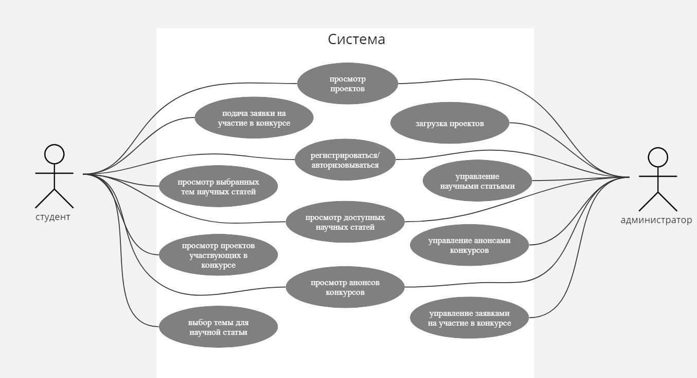

## Диаграмма вариантов использования


## Схема базы данных


<h2><details>

<summary>Пользовательские сценарии</summary>

<h6>Проекты студентов</h6>


<h6>Анонсы конкурсов</h6>


<h6>Темы научных статей</h6>


</details></h2>


## Установка

```bash
$ npm install
```

## Запуск приложения

```bash
# development
$ npm run start

# watch mode
$ npm run start:dev

# production mode
$ npm run start:prod
```
